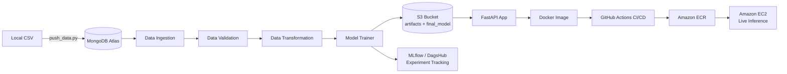
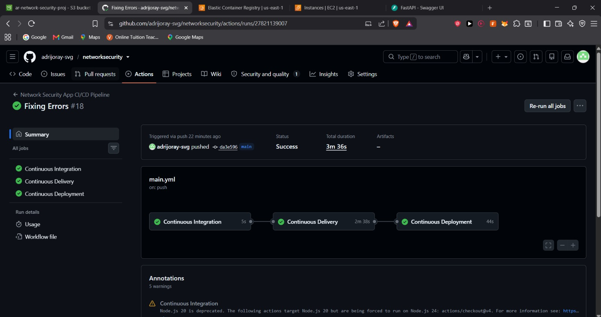
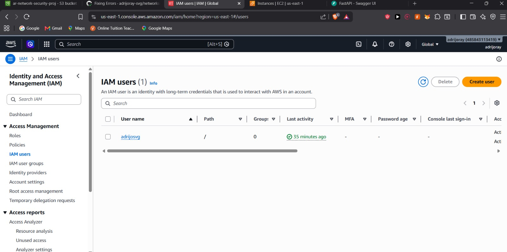
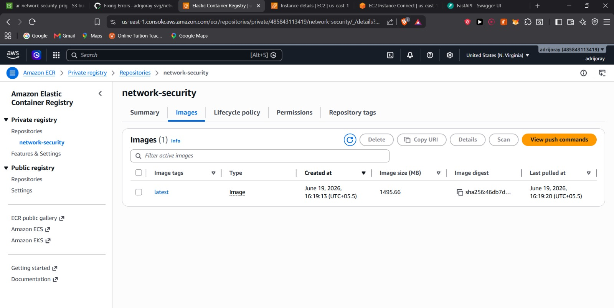
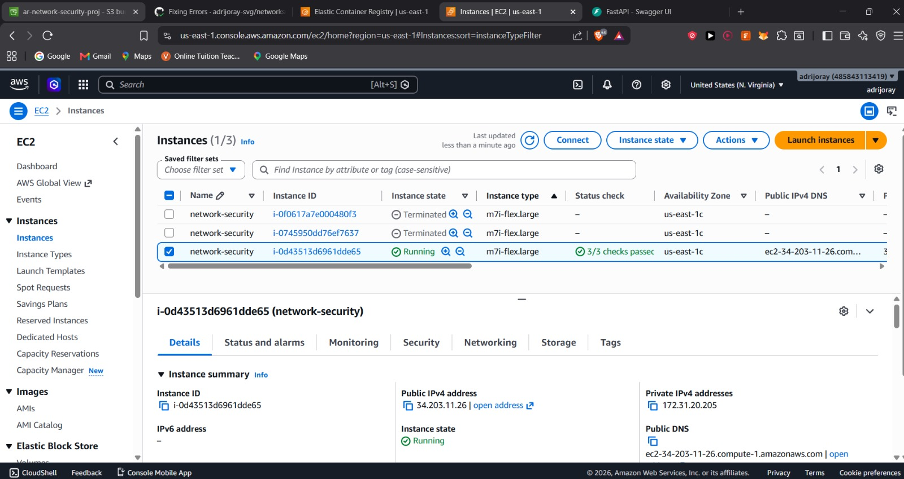
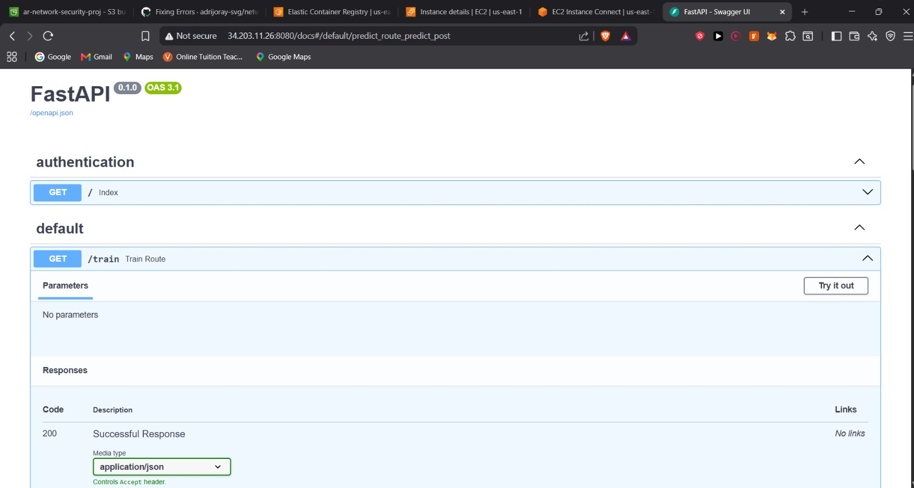
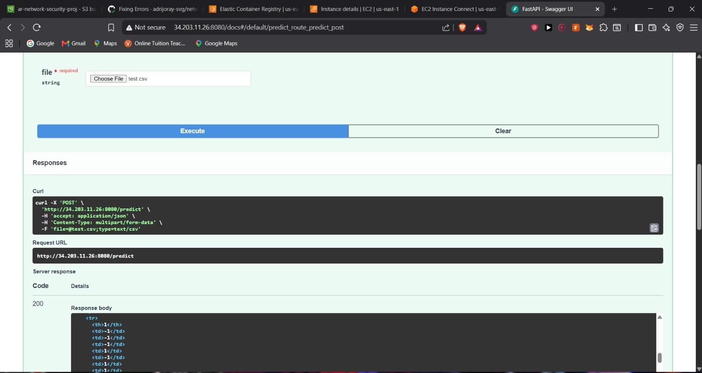
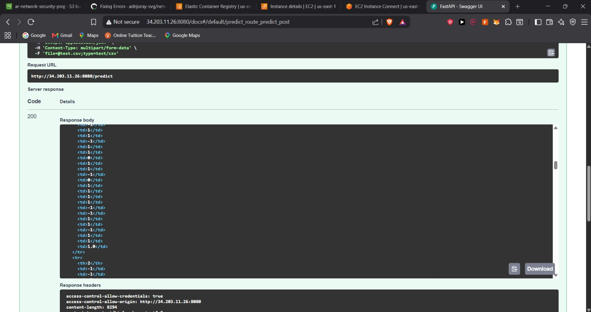

# Network Security — Phishing Website Detection

An end-to-end, production-style machine learning system that classifies a website as **phishing** or **legitimate** using 30 URL, domain, and HTML/JavaScript-based features. The project covers the full lifecycle: data ingestion from MongoDB Atlas, automated data validation and drift detection, transformation, multi-model training with experiment tracking, a FastAPI serving layer, containerization, and a CI/CD pipeline that deploys to AWS.


---

## Problem Statement

Phishing websites impersonate legitimate ones to steal credentials and sensitive information. Rather than relying on blocklists (which fail against new/unseen URLs), this project trains a supervised classifier on structural signals extracted from a website — properties of the URL string, the domain, and the page's HTML/JS behavior — to flag phishing sites before a user is harmed.

**Target variable:** `Result` → `1` = phishing, `-1` = legitimate
**Dataset:** [UCI Phishing Websites Dataset](https://archive.ics.uci.edu/dataset/327/phishing+websites) — 11,055 samples, 30 features, no missing values

The 30 features fall into three categories:

| Category | Examples |
|---|---|
| **URL-based (lexical)** | `having_IP_Address`, `URL_Length`, `Shortining_Service`, `having_At_Symbol`, `Prefix_Suffix`, `having_Sub_Domain` |
| **Domain-based** | `SSLfinal_State`, `Domain_registeration_length`, `age_of_domain`, `DNSRecord`, `Page_Rank`, `web_traffic` |
| **HTML/JS-based** | `Request_URL`, `URL_of_Anchor`, `SFH`, `on_mouseover`, `popUpWidnow`, `Iframe` |

---

## Tech Stack

| Layer | Tools |
|---|---|
| Language | Python |
| Data Storage | MongoDB Atlas (raw data), AWS S3 (artifacts & final model) |
| ML / Data | Pandas, Scikit-learn, SciPy |
| Experiment Tracking | MLflow + DagsHub (remote tracking server) |
| Serving | FastAPI |
| Containerization | Docker |
| CI/CD | GitHub Actions |
| Cloud / Registry | AWS ECR, AWS EC2, AWS IAM |

---

## Pipeline Architecture



### 1. Data Ingestion
Raw data is pushed from a local CSV into MongoDB Atlas (`push_data.py`). The ingestion component then pulls data from MongoDB via the client, performs a train/test split, and stores both sets in the `artifact` directory for the rest of the pipeline to consume.

### 2. Data Validation
Before transformation, the pipeline validates incoming data against an expected schema (`data_schema/schema.yml`) — checking that the number of columns matches expectations — and screens for **data drift** between train and test distributions using the **Kolmogorov–Smirnov two-sample test** (`scipy.stats.ks_2samp`). Validated datasets are written to `valid_data/` (separate validated train/test paths).

### 3. Data Transformation
Since all 30 features are pre-encoded categorical/numeric values (`-1`, `0`, `1`), missing values are imputed using **KNNImputer** applied across the full feature set.

### 4. Model Training & Evaluation
Five candidate models are trained and compared in a single pipeline stage:

```python
models = {
    'LogisticRegression': LogisticRegression(),
    'DecisionTree': DecisionTreeClassifier(),
    'RandomForest': RandomForestClassifier(),
    'AdaBoost': AdaBoostClassifier(),
    'GradientBoost': GradientBoostingClassifier()
}
```

Each model is evaluated on **Precision, Recall, and F1-score**, and every run is logged as an experiment to **MLflow**, tracked remotely via a **DagsHub** repository for full reproducibility. The best-performing model is serialized and saved to `final_model/`, then synced to the S3 bucket.

### 5. Orchestration Pipelines
- **Training Pipeline** (`main.py`) — chains ingestion → validation → transformation → training → evaluation into a single run.
- **Batch Prediction Pipeline** — accepts a new dataset and returns model predictions for every row.

### 6. Serving Layer (FastAPI)
`app.py` exposes:
- `GET /train` — triggers the training pipeline end-to-end
- `POST /predict` — accepts a CSV upload, runs batch inference, and returns predictions rendered as an HTML table (via `templates/`)

---

## Repository Structure

```
networksecurity/
├── .github/workflows/      # CI/CD pipeline definitions (GitHub Actions)
├── data_schema/             # Expected schema used for data validation
├── final_model/             # Serialized best model (synced to S3)
├── network_data/            # Raw source data
├── networksecurity/         # Core package — ingestion, validation,
│                             #   transformation, training, custom exception
│                             #   handling, logging, and config modules
├── prediction_output/        # Batch prediction outputs
├── templates/                # HTML templates for the FastAPI frontend
├── valid_data/                # Schema- and drift-validated train/test sets
├── app.py                    # FastAPI entry point (/train, /predict)
├── main.py                   # Training pipeline orchestrator
├── push_data.py               # Pushes local data into MongoDB Atlas
├── Dockerfile                 # Container definition for deployment
├── requirements.txt
├── setup.py                   # Packages `networksecurity` as an installable module
└── README.md
```

---

## Deployment & CI/CD

The application is containerized with Docker and deployed to AWS through a fully automated GitHub Actions pipeline with three stages — **Continuous Integration → Continuous Delivery → Continuous Deployment**:

1. **CI** — lints/checks the codebase on every push
2. **CD (Delivery)** — builds the Docker image and pushes it to **Amazon ECR**
3. **CD (Deployment)** — pulls the latest image onto an **Amazon EC2** instance and runs it, exposing the FastAPI app

An IAM user with scoped programmatic access powers the GitHub Actions → AWS connection, and pipeline artifacts plus the final trained model are persisted in an **S3 bucket**.

> **Note:** The EC2 instance and ECR repository were terminated after testing to avoid ongoing AWS free-tier charges. Screenshots below document the working deployment.

### Live Deployment Evidence

**CI/CD pipeline — all three stages passing**


**IAM user configured for programmatic AWS access**


**Docker image pushed to Amazon ECR**


**EC2 instance running the containerized app**


**FastAPI Swagger UI — `/train` endpoint**


**`/predict` endpoint — uploading a CSV for batch inference**


**`/predict` endpoint — returned predictions**



## Author

**Adrijo Ray**
[GitHub](https://github.com/adrijoray-svg) · [LinkedIn](https://www.linkedin.com/in/adrijo-ray/)